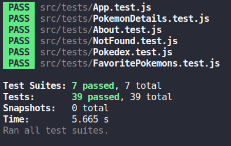

<h1 align="center">React Testing Library 🧪</h1>


<span align="center">


</span>



<p align="center">


</p>

# Sobre

Este projeto foi realizado durante o módulo de front-end da [Trybe]().

Este repositório tem o objetivo de demonstrar o desenvolvimento de testes de integração utilizando a testing library do react. 

⚠️ A aplicação a ser testada é propriedade intelectual daTrybe.

## Tecnologias usadas ⌨️

Front-end:
> Desenvolvido usando: 
> * React testing library;
> * Jest;
> * Jest-dom; 


## Instalando Dependências

```bash
git clone git@github.com:GabrielFerrariR/Trybetunes.git
cd Trybetunes
npm install
``` 

## Testando a aplicação


  ```
npm test
  ```

## Rodando a aplicação

A aplicação trata-se de uma pokedex, caso queira visualizar a aplicação escreva o comando abaixo no seu terminal
  ```
npm start
  ```